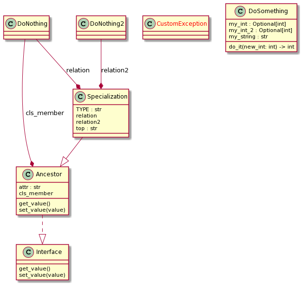

Additional Commands
===================

Pylint ships with some additional tools that can be executed from the command line once Pylint itself is installed.

Pyreverse
---------

``pyreverse`` analyzes your source code and generates package and class diagrams.
It supports output to ``.dot``/``.gv``, ``.vcg`` and ``.puml``/``.plantuml`` (PlantUML) file formats.
If Graphviz (or the ``dot`` command) is installed, all `output formats supported by Graphviz <https://graphviz.org/docs/outputs/>`_
can be used as well. In this case, ``pyreverse`` first generates a temporary ``.gv`` file, which is then
fed to Graphviz to generate the final image.

Running Pyreverse
'''''''''''''''''

To run ``pyreverse``, use::

  pyreverse [options] <packages>

<packages> can also be a single Python module.
The following options are availabe:

.. option:: -h, --help

   show this help message and exit

.. option:: -f <mode>, --filter-mode=<mode>

   Default: PUB_ONLY

   filter attributes and functions according to
   <mode>. Correct modes are:
   'PUB_ONLY': filter all non public attributes [DEFAULT], equivalent to PRIVATE+SPECIAL_A
   'ALL': no filter
   'SPECIAL': filter Python special functions except constructor
   'OTHER': filter protected and private attributes

.. option:: -c <class>, --class=<class>

   Default: none

   create a class diagram with all classes related to <class>; this uses by default the options -ASmy

.. option:: -a <ancestor>, --show-ancestors=<ancestor>

   show <ancestor> generations of ancestor classes not in <projects>

.. option:: -A, --all-ancestors

   show all ancestors off all classes in <projects>

.. option:: -s <association_level>, --show-associated=<association_level>

   show <association_level> levels of associated classes not in <projects>

.. option:: -S, --all-associated

   show recursively all associated off all associated classes

.. option:: -b, --show-builtin

   include builtin objects in representation of classes

.. option:: -m [yn], --module-names=[yn]

   include module name in representation of classes

.. option:: -k, --only-classnames

   don't show attributes and methods in the class boxes; this disables -f values

.. option:: -o <format>, --output=<format>

   Default: dot

   create a .<format> output file if format available.

.. option:: --colorized

   Default: False

   Use colored output. Classes/modules of the same package get the same color.

.. option:: --max-color-depth=<depth>

   Default: 2

   Use separate colors up to package depth of <depth>

.. option:: --ignore=<file[,file...]>

   Default: CVS

   Files or directories to be skipped. They should be base names, not paths.

.. option:: -p <project name>, --project=<project name>

   Default: none

   set the project name.

.. option:: -d <output_directory>, --output-directory=<output_directory>

   Default: none

   set the output directory path.

Example Output
''''''''''''''

Example diagrams generated with the .puml output format are shown below.

Class Diagram
.............

Package Diagram
...............

.. image:: ../media/pyreverse_example_packages.png
   :width: 344
   :height: 177
   :alt: Package diagram generated by pyreverse
   :align: center

Creating Class Diagrams for Specific Classes
''''''''''''''''''''''''''''''''''''''''''''

In many cases creating a single diagram depicting all classes in the project yields a rather unwieldy, giant diagram.
While limiting the input path to a single package or module can already help greatly to narrow down the scope, the ``-c`` option
provides another way to create a class diagram focusing on a single class and its collaborators.
For example, running::

  pyreverse -ASmy -c pylint.checkers.classes.ClassChecker pylint

will generate the full class and package diagrams for ``pylint``, but will additionally generate a file ``pylint.checkers.classes.ClassChecker.dot``:

.. image:: ../media/ClassChecker_diagram.png
   :width: 757
   :height: 1452
   :alt: Package diagram generated by pyreverse
   :align: center

Symilar
-------

The console script ``symilar`` finds copy pasted blocks in a set of files. It provides a command line interface to the ``Similar`` class, which includes the logic for
Pylint's ``duplicate-code`` message.
It can be invoked with::

  symilar [-d|--duplicates min_duplicated_lines] [-i|--ignore-comments] [--ignore-docstrings] [--ignore-imports] [--ignore-signatures] file1...

All files that shall be checked have to be passed in explicitly, e.g.::

  symilar foo.py, bar.py, subpackage/spam.py, subpackage/eggs.py

``symilar`` produces output like the following::

  17 similar lines in 2 files
  ==tests/data/clientmodule_test.py:3
  ==tests/data/suppliermodule_test.py:12
    class Ancestor:
        """ Ancestor method """
        __implements__ = (Interface,)
        cls_member = DoNothing()

        def __init__(self, value):
            local_variable = 0
            self.attr = 'this method shouldn\'t have a docstring'
            self.__value = value

        def get_value(self):
            """ nice docstring ;-) """
            return self.__value

        def set_value(self, value):
            self.__value = value
            return 'this method shouldn\'t have a docstring'
  TOTAL lines=58 duplicates=17 percent=29.31
