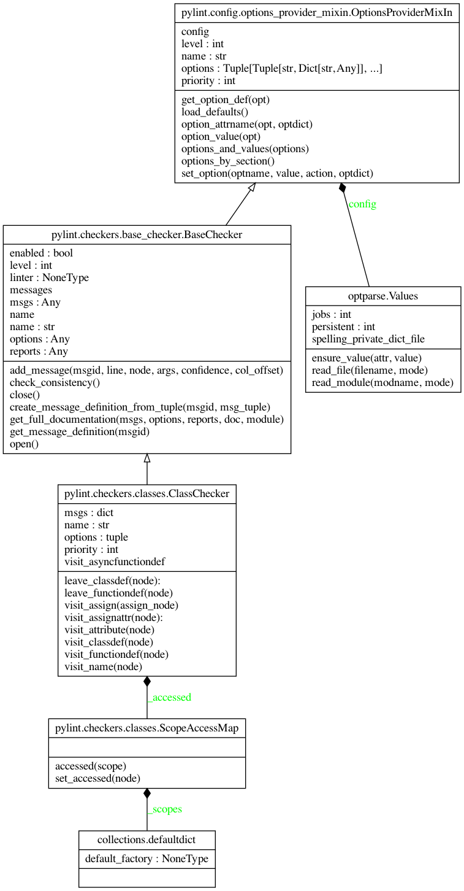

Additional Commands
===================

Pylint ships with some additional tools that can be executed from the command line once Pylint itself is installed.

Pyreverse
---------

``pyreverse`` analyzes your source code and generates package and class diagrams.
It supports output to ``.dot``/``.gv``, ``.vcg``, ``.puml``/``.plantuml`` (PlantUML) and ``.mmd``/``.html`` (MermaidJS) file formats.
If Graphviz (or the ``dot`` command) is installed, all `output formats supported by Graphviz <https://graphviz.org/docs/outputs/>`_
can be used as well. In this case, ``pyreverse`` first generates a temporary ``.gv`` file, which is then
fed to Graphviz to generate the final image.

Running Pyreverse
'''''''''''''''''

To run ``pyreverse``, use::

  pyreverse [options] <packages>

<packages> can also be a single Python module.
To see a full list of the available options, run::

   pyreverse -h

Example Output
''''''''''''''

Example diagrams generated with the ``.puml`` output format are shown below.

Class Diagram
.............

.. image:: ../media/pyreverse_example_classes.png
   :width: 625
   :height: 589
   :alt: Class diagram generated by pyreverse
   :align: center

Package Diagram
...............

.. image:: ../media/pyreverse_example_packages.png
   :width: 344
   :height: 177
   :alt: Package diagram generated by pyreverse
   :align: center

Creating Class Diagrams for Specific Classes
''''''''''''''''''''''''''''''''''''''''''''

In many cases creating a single diagram depicting all classes in the project yields a rather unwieldy, giant diagram.
While limiting the input path to a single package or module can already help greatly to narrow down the scope, the ``-c`` option
provides another way to create a class diagram focusing on a single class and its collaborators.
For example, running::

  pyreverse -ASmy -c pylint.checkers.classes.ClassChecker pylint

will generate the full class and package diagrams for ``pylint``, but will additionally generate a file ``pylint.checkers.classes.ClassChecker.dot``:

Symilar
-------

The console script ``symilar`` finds copy pasted blocks in a set of files. It provides a command line interface to the ``Similar`` class, which includes the logic for
Pylint's ``duplicate-code`` message.
It can be invoked with::

  symilar [-d|--duplicates min_duplicated_lines] [-i|--ignore-comments] [--ignore-docstrings] [--ignore-imports] [--ignore-signatures] file1...

All files that shall be checked have to be passed in explicitly, e.g.::

  symilar foo.py, bar.py, subpackage/spam.py, subpackage/eggs.py

``symilar`` produces output like the following::

  17 similar lines in 2 files
  ==tests/data/clientmodule_test.py:3
  ==tests/data/suppliermodule_test.py:12
    class Ancestor:
        """ Ancestor method """
        __implements__ = (Interface,)
        cls_member = DoNothing()

        def __init__(self, value):
            local_variable = 0
            self.attr = 'this method shouldn\'t have a docstring'
            self.__value = value

        def get_value(self):
            """ nice docstring ;-) """
            return self.__value

        def set_value(self, value):
            self.__value = value
            return 'this method shouldn\'t have a docstring'
  TOTAL lines=58 duplicates=17 percent=29.31
