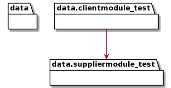

.. _pyreverse:

Pyreverse
---------

``pyreverse`` analyzes your source code and generates package and class diagrams.

It supports output to ``.dot``/``.gv``, ``.puml``/``.plantuml`` (PlantUML) and ``.mmd``/``.html`` (MermaidJS) file formats.
If Graphviz (or the ``dot`` command) is installed, all `output formats supported by Graphviz <https://graphviz.org/docs/outputs/>`_
can be used as well. In this case, ``pyreverse`` first generates a temporary ``.gv`` file, which is then
fed to Graphviz to generate the final image.

Using Pyreverse
'''''''''''''''''

To run ``pyreverse``, use::

  pyreverse [options] <packages>

[options] can be specified to modify the behavior of pyreverse, and
<packages> can either be a package or a list of modules separated by spaces.

Configuration Options
.....................

To see a full list of the available [options], run::

   pyreverse -h

For detailed descriptions of the command-line options available for Pyreverse, refer to the dedicated `Pyreverse Configuration Options <configuration.html>`_ page. This page includes sections on:

* `Filtering and Scope <configuration.html#filtering-and-scope>`_ - Options for filtering classes and limiting the scope of the generated diagrams.
* `Display Options <configuration.html#display-options>`_ - Customize how diagrams are rendered, including colors and module names.
* `Output Control <configuration.html#output-control>`_ - Specify output formats and directory locations for generated files.
* `Project Configuration <configuration.html#project-configuration>`_ - Configure project-specific settings such as ignored files and source roots.

.. toctree::
  :maxdepth: 1
  :hidden:

Example Output
''''''''''''''

Example diagrams generated with the ``.puml`` output format are shown below.

Class Diagram
.............

.. image:: ../../media/pyreverse_example_classes.png
   :width: 625
   :height: 589
   :alt: Class diagram generated by pyreverse
   :align: center

Package Diagram
...............

Creating Class Diagrams for Specific Classes
''''''''''''''''''''''''''''''''''''''''''''

In many cases creating a single diagram depicting all classes in the project yields a rather unwieldy, giant diagram.
While limiting the input path to a single package or module can already help greatly to narrow down the scope, the ``-c`` option
provides another way to create a class diagram focusing on a single class and its collaborators.
For example, running::

  pyreverse -ASmy -c pylint.checkers.classes.ClassChecker pylint

will generate the full class and package diagrams for ``pylint``, but will additionally generate a file ``pylint.checkers.classes.ClassChecker.dot``:

.. image:: ../../media/ClassChecker_diagram.png
   :width: 757
   :height: 1452
   :alt: Package diagram generated by pyreverse
   :align: center

.. toctree::
  :maxdepth: 1
  :hidden:

  configuration
