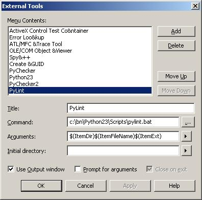

=================
 IDE integration
=================

To use Pylint with:

 - Emacs_, see http://www.emacswiki.org/emacs/PythonProgrammingInEmacs#toc8,
 - Vim_, see http://www.vim.org/scripts/script.php?script_id=891,
 - Eclipse_ and PyDev_, see http://pydev.org/manual_adv_pylint.html,
 - Komodo_, see http://mateusz.loskot.net/posts/2006/01/15/running-pylint-from-komodo/,
 - gedit_, see https://launchpad.net/gedit-pylint-2 or https://wiki.gnome.org/Apps/Gedit/PylintPlugin,
 - WingIDE_, see http://www.wingware.com/doc/edit/pylint,
 - PyCharm_, see http://blog.saturnlaboratories.co.za/archive/2012/09/10/running-pylint-pycharm.

Pylint is integrated in:

 - Eric_ IDE, see the `Project > Check` menu,
 - Spyder_, see http://packages.python.org/spyder/pylint.html,
 - pyscripter_, see the `Tool -> Tools` menu.

.. _Emacs: http://www.gnu.org/software/emacs/
.. _Vim: http://www.vim.org/
.. _Eclipse: https://www.eclipse.org/
.. _Eric: http://eric-ide.python-projects.org/
.. _pyscripter: http://code.google.com/p/pyscripter/
.. _pydev: http://pydev.org
.. _Komodo: http://www.activestate.com/Products/Komodo/
.. _gedit: https://wiki.gnome.org/Apps/Gedit
.. _WingIDE: http://www.wingware.com/
.. _spyder: http://code.google.com/p/spyderlib/
.. _PyCharm: http://www.jetbrains.com/pycharm/

Using Pylint thru flymake in Emacs
==================================

To enable flymake for Python, insert the following into your .emacs:

.. sourcecode:: common-lisp

    ;; Configure flymake for Python
    (when (load "flymake" t)
      (defun flymake-pylint-init ()
        (let* ((temp-file (flymake-init-create-temp-buffer-copy
                           'flymake-create-temp-inplace))
               (local-file (file-relative-name
                            temp-file
                            (file-name-directory buffer-file-name))))
          (list "epylint" (list local-file))))
      (add-to-list 'flymake-allowed-file-name-masks
                   '("\\.py\\'" flymake-pylint-init)))

    ;; Set as a minor mode for Python
    (add-hook 'python-mode-hook '(lambda () (flymake-mode)))

Above stuff is in pylint/elisp/pylint-flymake.el, which should be automatically
installed on Debian systems, in which cases you don't have to put it in your .emacs file.

Other things you may find useful to set:

.. sourcecode:: common-lisp

    ;; Configure to wait a bit longer after edits before starting
    (setq-default flymake-no-changes-timeout '3)

    ;; Keymaps to navigate to the errors
    (add-hook 'python-mode-hook '(lambda () (define-key python-mode-map "\C-cn" 'flymake-goto-next-error)))
    (add-hook 'python-mode-hook '(lambda () (define-key python-mode-map "\C-cp" 'flymake-goto-prev-error)))

Finally, by default flymake only displays the extra information about the error when you
hover the mouse over the highlighted line. The following will use the minibuffer to display
messages when you the cursor is on the line.

.. sourcecode:: common-lisp

    ;; To avoid having to mouse hover for the error message, these functions make flymake error messages
    ;; appear in the minibuffer
    (defun show-fly-err-at-point ()
      "If the cursor is sitting on a flymake error, display the message in the minibuffer"
      (require 'cl)
      (interactive)
      (let ((line-no (line-number-at-pos)))
        (dolist (elem flymake-err-info)
          (if (eq (car elem) line-no)
    	  (let ((err (car (second elem))))
    	    (message "%s" (flymake-ler-text err)))))))

    (add-hook 'post-command-hook 'show-fly-err-at-point)

Alternative, if you only wish to pollute the minibuffer after an explicit flymake-goto-* then use
the following instead of a post-command-hook

.. sourcecode:: common-lisp

    (defadvice flymake-goto-next-error (after display-message activate compile)
      "Display the error in the mini-buffer rather than having to mouse over it"
      (show-fly-err-at-point))

    (defadvice flymake-goto-prev-error (after display-message activate compile)
      "Display the error in the mini-buffer rather than having to mouse over it"
      (show-fly-err-at-point))

Setup the MS Visual Studio .NET 2003 editor to call Pylint
==========================================================

The output of Pylint is then shown in the "Output" pane of the editor.
