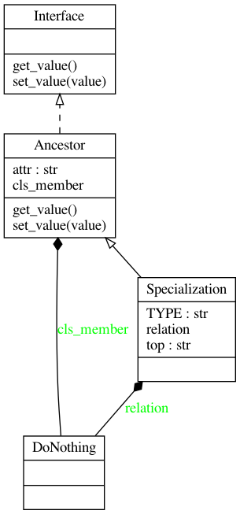
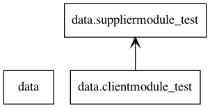
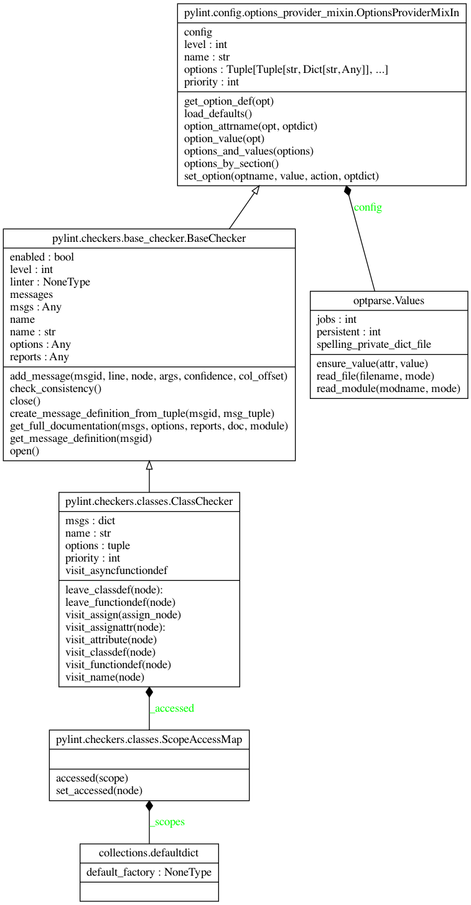

.. _pyreverse:

Pyreverse
---------

``pyreverse`` analyzes your source code and generates package and class diagrams.

It supports output to ``.dot``/``.gv``, ``.puml``/``.plantuml`` (PlantUML) and ``.mmd``/``.html`` (MermaidJS) file formats.
If Graphviz (or the ``dot`` command) is installed, all `output formats supported by Graphviz <https://graphviz.org/docs/outputs/>`_
can be used as well. In this case, ``pyreverse`` first generates a temporary ``.gv`` file, which is then
fed to Graphviz to generate the final image.

Running Pyreverse
'''''''''''''''''

To run ``pyreverse``, use::

  pyreverse [options] <packages>

<packages> can also be a single Python module.
To see a full list of the available options, run::

   pyreverse -h

Example Output
''''''''''''''

Example diagrams generated with the ``.puml`` output format are shown below.

Class Diagram
.............

Package Diagram
...............

Creating Class Diagrams for Specific Classes
''''''''''''''''''''''''''''''''''''''''''''

In many cases creating a single diagram depicting all classes in the project yields a rather unwieldy, giant diagram.
While limiting the input path to a single package or module can already help greatly to narrow down the scope, the ``-c`` option
provides another way to create a class diagram focusing on a single class and its collaborators.
For example, running::

  pyreverse -ASmy -c pylint.checkers.classes.ClassChecker pylint

will generate the full class and package diagrams for ``pylint``, but will additionally generate a file ``pylint.checkers.classes.ClassChecker.dot``:

