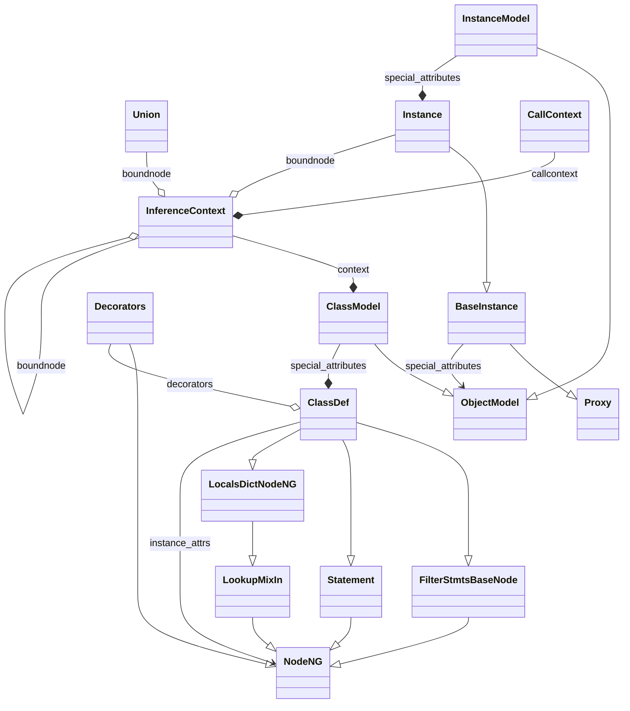

<!-- pyreverse-primer-comment -->
🤖 **Effect of this PR on tracked pyreverse diagrams:** 🤖

**Effect on `ClassDef` in [astroid](https://github.com/pylint-dev/astroid):**

<details>
<summary>Diagram diff</summary>

```diff
--- main
+++ pr
@@ -29,12 +29,15 @@
   }
   class ClassDef {
   }
+  class Decorators {
+  }
   BaseInstance --|> Proxy
   Instance --|> BaseInstance
   ClassModel --|> ObjectModel
   InstanceModel --|> ObjectModel
   FilterStmtsBaseNode --|> NodeNG
   LookupMixIn --|> NodeNG
+  Decorators --|> NodeNG
   Statement --|> NodeNG
   LocalsDictNodeNG --|> LookupMixIn
   ClassDef --|> FilterStmtsBaseNode
@@ -46,6 +49,7 @@
   InferenceContext --* ClassModel : context
   ClassModel --* ClassDef : special_attributes
   InstanceModel --* Instance : special_attributes
+  Decorators --o ClassDef : decorators
   Union --o InferenceContext : boundnode
   Instance --o InferenceContext : boundnode
   InferenceContext --o InferenceContext : boundnode
```
</details>

<details>
<summary>Rendered diagram</summary>


</details>

*This comment was generated for commit deadbeef*
