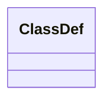

<!-- pyreverse-primer-comment -->
🤖 **Effect of this PR on tracked pyreverse diagrams:** 🤖

**Effect on `ClassDef` in [astroid](https://github.com/pylint-dev/astroid):**

<details>
<summary>Diagram diff</summary>

```diff
--- main
+++ pr
@@ -1,5 +1,3 @@
 classDiagram
   class ClassDef {
-    infer()
-    do_normalize_attributes()
   }
```
</details>

<details>
<summary>Rendered diagram</summary>


</details>

*This comment was generated for commit deadbeef*
