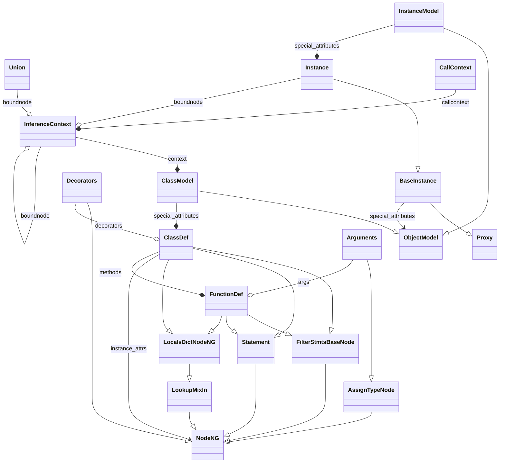

<!-- pyreverse-primer-comment -->
🤖 **Effect of this PR on tracked pyreverse diagrams:** 🤖

**Effect on `ClassDef` in [astroid](https://github.com/pylint-dev/astroid):**

<details>
<summary>Diagram diff</summary>

```diff
--- main
+++ pr
@@ -29,23 +29,40 @@
   }
   class ClassDef {
   }
+  class AssignTypeNode {
+  }
+  class Arguments {
+  }
+  class Decorators {
+  }
+  class FunctionDef {
+  }
   BaseInstance --|> Proxy
   Instance --|> BaseInstance
   ClassModel --|> ObjectModel
   InstanceModel --|> ObjectModel
   FilterStmtsBaseNode --|> NodeNG
   LookupMixIn --|> NodeNG
+  AssignTypeNode --|> NodeNG
+  Arguments --|> AssignTypeNode
+  Decorators --|> NodeNG
   Statement --|> NodeNG
   LocalsDictNodeNG --|> LookupMixIn
   ClassDef --|> FilterStmtsBaseNode
   ClassDef --|> Statement
   ClassDef --|> LocalsDictNodeNG
+  FunctionDef --|> FilterStmtsBaseNode
+  FunctionDef --|> Statement
+  FunctionDef --|> LocalsDictNodeNG
   BaseInstance --> ObjectModel : special_attributes
   ClassDef --> NodeNG : instance_attrs
   CallContext --* InferenceContext : callcontext
   InferenceContext --* ClassModel : context
   ClassModel --* ClassDef : special_attributes
   InstanceModel --* Instance : special_attributes
+  ClassDef --* FunctionDef : methods
+  Arguments --o FunctionDef : args
+  Decorators --o ClassDef : decorators
   Union --o InferenceContext : boundnode
   Instance --o InferenceContext : boundnode
   InferenceContext --o InferenceContext : boundnode
```
</details>

<details>
<summary>Rendered diagram after this change</summary>


</details>

*This comment was generated for commit deadbeef*
